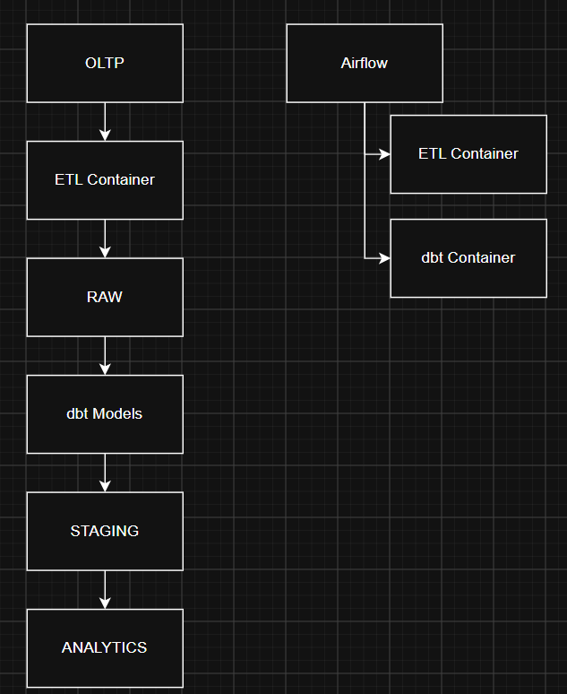

# Projeto Engenharia de Dados



## Sobre o Projeto

Este projeto foi desenvolvido com o objetivo de praticar os principais conceitos de Engenharia de Dados através da construção de um pipeline completo de dados utilizando PostgreSQL, Python, Docker, dbt e Apache Airflow.

Ao longo do desenvolvimento, o projeto evoluiu de uma arquitetura baseada exclusivamente em transformações Python para uma arquitetura ELT moderna, utilizando dbt para transformações, testes e documentação, além de Apache Airflow para orquestração dos pipelines.

O resultado é uma solução completa contendo ingestão de dados, modelagem analítica, testes automatizados, documentação e orquestração de containers.

---

# Objetivos

Durante o desenvolvimento deste projeto foram praticados conceitos como:

- Modelagem de Dados
- SQL para Analytics
- Desenvolvimento de ETLs com Python
- Arquitetura de Data Warehouse
- Arquitetura ELT
- Transformações com dbt
- Data Quality
- Data Lineage
- Documentação automática
- Containerização com Docker
- Orquestração de pipelines com Apache Airflow
- Versionamento com Git e GitHub

---

# Arquitetura da Solução

A arquitetura final do projeto segue o fluxo:

```text
OLTP
  ↓
Python ETL
  ↓
RAW
  ↓
dbt
  ↓
STAGING
  ↓
dbt
  ↓
ANALYTICS
```

A execução de todo o pipeline é orquestrada pelo Apache Airflow utilizando DockerOperator.

```text
Airflow
    ↓
etl_app
    ↓
RAW
    ↓
dbt_runner
    ↓
STAGING
    ↓
ANALYTICS
    ↓
dbt test
```

---

# Camadas do Data Warehouse

## OLTP

Camada transacional contendo os dados operacionais utilizados como origem dos dados.

## RAW

Camada responsável por armazenar os dados extraídos do sistema transacional sem aplicação de regras de negócio.

## STAGING

Camada intermediária responsável por:

- Padronização de dados
- Renomeação de colunas
- Organização das informações para consumo analítico

As models desta camada são materializadas como Views.

## ANALYTICS

Camada analítica responsável pela construção das tabelas dimensionais e fatos utilizadas para análise de dados e consumo por ferramentas de BI.

---

# Tecnologias Utilizadas

## Banco de Dados

- PostgreSQL

## Linguagens

- SQL
- Python

## Ferramentas

- Docker
- Apache Airflow
- dbt
- Git
- GitHub

## Bibliotecas

- psycopg2
- python-dotenv
- dbt-postgres

---

# Estrutura do Projeto

```text
Projeto Engenharia de Dados
│
├── airflow
│   ├── dags
│   ├── logs
│   ├── plugins
│   └── docker-compose-airflow.yml
│
├── docs
│
├── etl
│   ├── oltp_raw
│   ├── legado
│   ├── seed_oltp.py
│   ├── main.py
│   ├── config.py
│   ├── Dockerfile
│   └── requirements.txt
│
├── projeto_dbt
│   ├── models
│   │   ├── staging
│   │   └── analytics
│   │
│   ├── tests
│   ├── macros
│   ├── snapshots
│   ├── dbt_project.yml
│   ├── profiles.yml
│   └── Dockerfile
│
├── sql
│
├── docker-compose.yml
├── .env.example
├── README.md
└── .gitignore
```

---

# Pipeline de Ingestão

O processo de ingestão é realizado por pipelines Python responsáveis por carregar dados da camada OLTP para a camada RAW.

Tabelas processadas:

- clientes
- clinicas
- origens
- produtos
- vendas

Fluxo:

```text
OLTP
  ↓
Python
  ↓
RAW
```

---

# Transformações com dbt

Após a ingestão dos dados, todas as transformações são realizadas através do dbt.

## Camada Staging

Models:

- stg_clientes
- stg_clinicas
- stg_origens
- stg_produtos
- stg_vendas

Transformações:

- Padronização de textos
- Renomeação de colunas
- Organização dos dados para análise

## Camada Analytics

### dim_clientes

Responsável por consolidar informações dos clientes.

Inclui o cálculo da coluna:

```sql
EXTRACT(YEAR FROM AGE(CURRENT_DATE, data_nasc))
```

gerando o atributo:

```text
idade
```

### fato_vendas

Responsável por consolidar informações de vendas através de joins entre as entidades de negócio.

Inclui a criação dos atributos:

```sql
EXTRACT(YEAR FROM data_venda)
```

```sql
EXTRACT(MONTH FROM data_venda)
```

gerando:

- ano_venda
- mes_venda

---

# Qualidade dos Dados

O projeto utiliza testes nativos do dbt para validação dos dados.

## not_null

Validação de preenchimento obrigatório.

Exemplos:

- id_cliente
- cpf
- genero
- id_venda

## unique

Validação de unicidade.

Exemplos:

- id_cliente
- cpf

## accepted_values

Validação de domínio.

Exemplo:

```text
M
F
```

## relationships

Validação de integridade referencial.

Exemplos:

- vendas → clientes
- vendas → produtos
- vendas → clinicas

---

# Orquestração com Apache Airflow

O projeto utiliza Apache Airflow para orquestrar os containers responsáveis pela execução do pipeline.

Fluxo implementado:

```text
ETL Python
    ↓
dbt run
    ↓
dbt test
```

Exemplo de DAG:

```text
extract_load
    ↓
dbt_transform
    ↓
dbt_test
```

A comunicação entre os containers é realizada através de redes Docker compartilhadas, permitindo que os pipelines acessem o PostgreSQL durante a execução.

---

# Documentação e Data Lineage

O dbt gera automaticamente documentação técnica e Data Lineage do projeto.

Comandos:

```bash
dbt docs generate
```

```bash
dbt docs serve
```

A documentação permite visualizar:

- Sources
- Models
- Dependências
- Data Lineage
- Colunas
- Descrições
- Testes

---

# Fluxo Completo de Execução

```text
Docker Compose
    ↓
PostgreSQL
    ↓
DDL OLTP + RAW
    ↓
Seed OLTP
    ↓
Python ETL
    ↓
RAW
    ↓
dbt run
    ↓
STAGING
    ↓
ANALYTICS
    ↓
dbt test
```

Ou de forma automatizada:

```text
Airflow
    ↓
DockerOperator
    ↓
etl_app
    ↓
dbt_runner
    ↓
dbt test
```

---

# Como Executar

## 1. Clonar o Repositório

```bash
git clone https://github.com/brenocampos13/projeto-engenharia-dados.git
```

## 2. Configurar Variáveis de Ambiente

Criar um arquivo:

```text
.env
```

utilizando como base:

```text
.env.example
```

## 3. Subir PostgreSQL

```bash
docker compose up -d
```

## 4. Executar ETL

```bash
python etl/main.py
```

## 5. Executar Transformações

```bash
dbt run
```

## 6. Executar Testes

```bash
dbt test
```

## 7. Executar Orquestração com Airflow

```bash
docker compose -f docker-compose-airflow.yml up -d
```

Interface:

```text
http://localhost:8080
```

---

# Autor

**Breno Campos Franco**

Projeto desenvolvido como parte da formação prática em Engenharia de Dados, com foco em:

- Data Warehousing
- ETL / ELT
- PostgreSQL
- Docker
- dbt
- Apache Airflow
- Arquitetura de Dados Moderna

---

# Status do Projeto

```text
✅ Concluído
```

Tecnologias praticadas:

```text
✅ SQL
✅ PostgreSQL
✅ Python
✅ ETL
✅ Git
✅ GitHub
✅ Docker
✅ dbt
✅ Apache Airflow
```
